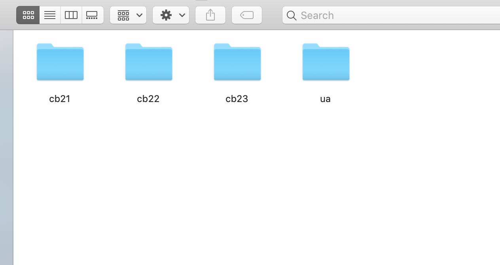
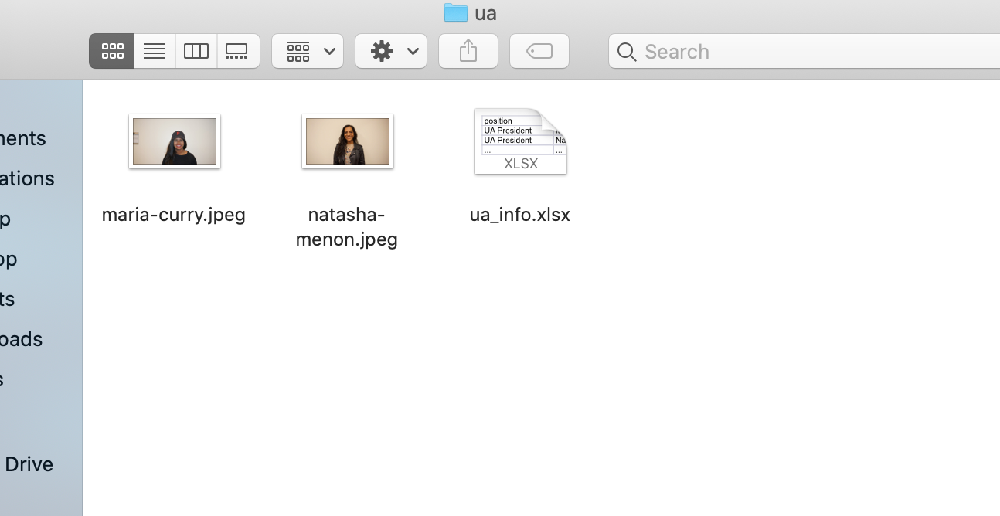
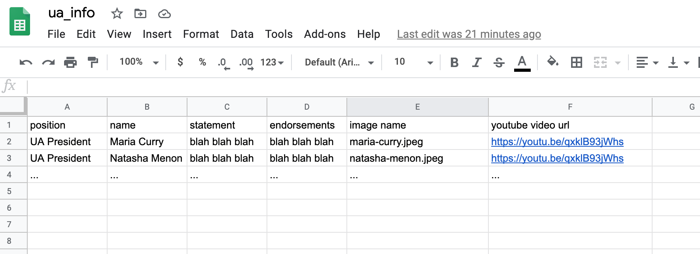

# Expected content in the NEC candidates folder

### Introduction

- I am Peter Chen, the Director of the Web Department (i.e. the person who is going to create the NEC website). If you have any question, reach out to me at **chen@dailypennsylvanian.com**
- Why you want to read this: to make things easy to work out for both you and me so I can deliver the best quality :)

### Folder Structure

```
  ua/
    ua_info.xlsx          spreadsheet that includes info of all candidates running for UA
    maria-curry.jpeg      photo of the candidate
    natasha-menon.jpeg    photo of the candidate
    ...
  cb21/
    cb21_info.xlsx        spreadsheet that includes info of all candidates running for class board 21
    maria-curry.jpeg      photo of the candidate
    natasha-menon.jpeg    photo of the candidate
    ...
  cb22/
    cb22_info.xlsx
    maria-curry.jpeg      photo of the candidate
    natasha-menon.jpeg    photo of the candidate
    ...
  cb23/
    cb23_info.xlsx
    maria-curry.jpeg      photo of the candidate
    natasha-menon.jpeg    photo of the candidate
    ...
```



- There should only be 4 folders: `ua` for storing information of candidates running for UA positions, `cb21` for class board 21', `cb22` for class board 22' and `cb23` for class board 23'
- Each folder should include a spread sheet file (instructions below on how to create this file) that has all the candidate info for that board + the images of all candidates **cropped to squares**. By square I mean height of the image = width of the image. The person should appear at the center of the picture.
- As a result of this, **PLEASE DO NOT PUT THE INFO OF EACH CANDIDATE IN A SEPARATE FOLDER**
- This is what I want to see when I open the folder (using `ua` as an illustration). The pictures need to be squares though.
  

---

### How to create `info.xlsx`

- Use Google Sheets (unless you really enjoy the experience of using Microsoft Excel) to create a spread sheet. Follow the same format as shown in the picture (should be self-explanatory)
  

A few things I want to highlight:

- **The first row of each spread sheet should be the header**
- **The name of the position should be consistent**. If you use "UA President" for one candidate, please do so for other candidates. Do not use "ua President" or "UA president". This is also required across spread sheets. If you use "President" for info sheet for class board 21, you should also use "President" in the info sheet for other boards.
- **Do not include HTML symbols in both statements and endorsements**. Both should be just pure text. Not sure why this is the case, but when I looked at the data from last year, people had `<br />` and `<a>` links.
- **Image name should be unique**. The way I am doing it is `firstname-lastname`, but you may choose a different one. For image name, please include the file extension as well (whether it's jpeg or jpg). If `maria-curry.jpeg` is what appears in the folder, you should have `maria-curry.jpeg` under image name for this candidate.
- The quickest way to get a proper url for your YouTube video is to open the video, right click, and hit "copy video URL". Paste that into the spread sheet.
  
- I assume you are using Google Sheets. If so, the preferred way is to share all spread sheets to my DP account **chen@dailypennsylvanian.com** once you finish. That way, you can ignore the `info.xlsx` file listed in the folder structure. If you are using Excel, however, please include the files in the folder and send it to me.
- By the end of the day, you will have to give me the pictures of each candidate as well, so either you zip it and send it to me via email or upload to google drive and share it with me (this is the more preferred way).

---

### Contact

Again, if you have question/ concern/ doubt/ complaint, reach out to me at **chen@dailypennsylvanian.com**. Thank you!
